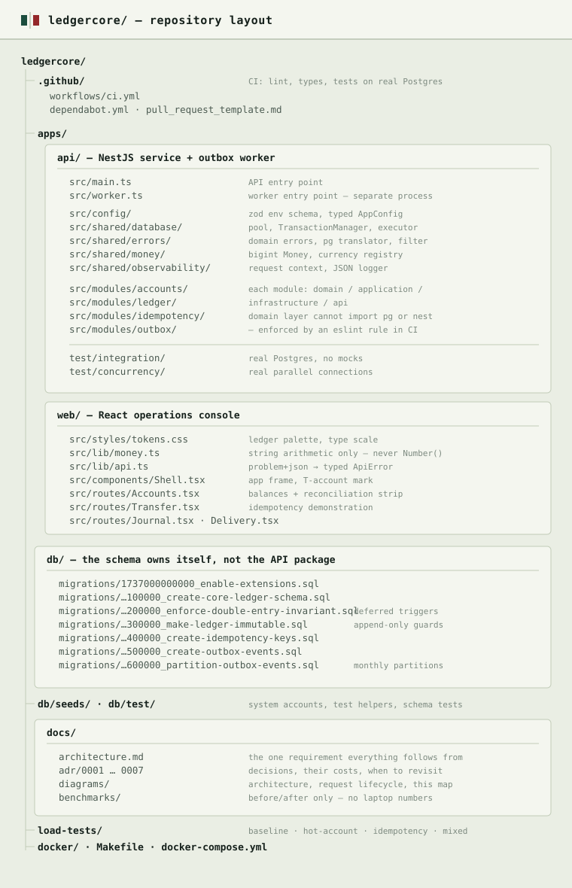

# LedgerCore

[](https://github.com/USERNAME/ledgercore/actions/workflows/ci.yml)


A double-entry ledger built on PostgreSQL, with the correctness properties
enforced where they cannot be bypassed.

The system does one thing: it records money moving between accounts. Its only
real requirement is that it is never wrong — no money is created, none
disappears, and no transfer is applied twice, including when requests arrive
at the same instant, when a client retries, and when a process dies
mid-flight.

Everything in this repository follows from that requirement. Where a decision
had a real cost, it is recorded in [an ADR](docs/adr/) along with what was
given up.

> Replace `USERNAME` in the badge above with your GitHub handle once the
> repository is pushed.

---

## How it fits together


The API and the worker share a codebase and a database but run as separate
processes. That is what lets a transfer and its outbox event commit in one
transaction while a slow consumer can never add latency to the transfer or
exhaust the pool the ledger depends on.

The full request path, including where the locks are taken and where the
deferred triggers fire, is in
[docs/diagrams/request-lifecycle.mermaid](docs/diagrams/request-lifecycle.mermaid).

## Where things live



---

## What is interesting here

**Balances are not stored.** There is no `balance` column. Every figure is
summed from an immutable entry log, which means there is exactly one source of
truth and no possibility of drift. The trade — reads cost an aggregation
instead of a lookup — is bounded by a covering index, and an integration test
asserts the query plan is still an index-only scan.
[ADR-0002](docs/adr/0002-no-balance-column.md)

**The invariants live in the database.** Four rules define a valid
transaction, and none of them can be expressed as a `CHECK` because each is a
property of the _set_ of entries. They are enforced by deferred constraint
triggers that fire at `COMMIT`, so a migration, a script, or a future service
physically cannot write an unbalanced transaction.
[ADR-0005](docs/adr/0005-database-enforced-invariants.md)

**Transfers serialise with ordered row locks, not `SERIALIZABLE`.** Locks are
taken on account rows in ascending id order, which is what prevents the
classic A→B / B→A deadlock. The comparison against Serializable Snapshot
Isolation — and why optimistic concurrency is the wrong trade on a hot account
— is written down rather than assumed.
[ADR-0006](docs/adr/0006-locking-strategy.md)

**Idempotency is atomic with the write it guards.** The key and the ledger
entries commit in one transaction. Recording the key separately has no safe
ordering: before the write, a crash blocks the client's retry forever; after
it, the retry runs the transfer twice.

**Events use a transactional outbox.** The event row is written alongside the
entries, and a separate worker process drains it with `FOR UPDATE SKIP
LOCKED`. Publishing to a queue directly would be a dual write with the same
unfixable ordering problem.

**Money never touches a float.** Amounts are `BIGINT` minor units, wrapped in
a `bigint`-backed value object, serialised as strings at every boundary
including JSON — because a JSON number is IEEE 754 and would corrupt large
amounts silently. Even the browser's formatting code works in strings.
[ADR-0001](docs/adr/0001-monetary-values-as-bigint.md)

---

## Running it

```bash
pnpm install
cp .env.example .env

make up                                          # postgres + redis
pnpm migrate
psql "$DATABASE_URL" -f db/seeds/01-system-accounts.sql

pnpm --filter @ledgercore/api dev                # API      :3000
pnpm --filter @ledgercore/api dev:worker         # worker
pnpm --filter @ledgercore/web dev                # console  :5173
```

Requires Node 20+, pnpm 9+, and Docker.

The console opens on Accounts. Add a person, open an account, deposit into it,
then move money — the Journal shows both sides of every movement and Delivery
shows the events draining.

### The demonstration worth trying

On **Move money**, set _copies to send at once_ to five and press send. All
five requests carry the same idempotency key and are sent in parallel, which
is the situation a gateway timeout produces in production.

One is applied. Four come back with the first one's stored response. The
balance moves once.

---

## Layout

```
apps/api/     NestJS service and the outbox worker
apps/web/     React operations console
db/           migrations, seeds, and the tests that prove the schema
docs/adr/     architecture decision records
load-tests/   k6 scenarios
```

Inside `apps/api`, each module is split by layer:

```
domain/          pure logic — no framework, no database, no I/O
application/     use cases; owns transaction boundaries
infrastructure/  SQL and external clients
api/             HTTP controllers and schemas
```

The `domain` layer's isolation is enforced by an ESLint rule that fails CI on
a `pg` or `@nestjs` import, rather than being left to review.
[ADR-0004](docs/adr/0004-modular-monolith.md)

Migrations live in `db/` rather than inside the API package, because the
schema belongs to the database and not to one of the processes that reads it.

---

## Tests

```bash
pnpm test                                        # everything
pnpm --filter @ledgercore/api test:unit          # no database, milliseconds
pnpm --filter @ledgercore/api test:integration   # real postgres
pnpm --filter @ledgercore/api test:concurrency   # real parallel connections
```

Three layers, all run in CI against a real PostgreSQL 16 service. There are no
database mocks: every guarantee this system makes is a database behaviour —
deferred triggers, row locks, isolation levels, `SKIP LOCKED` — and a mock
would verify none of it.

The concurrency suite is the one worth reading. It races real requests against
each other and asserts outcomes, not absence of errors:

- ten simultaneous transfers against a balance covering three must yield
  **exactly three** successes; nine failures would be as wrong as four
  successes
- transfers in opposite directions between the same pair, and an eight-account
  ring, both of which deadlock immediately under request-order locking
- one test deliberately locks in the wrong order and asserts a deadlock
  occurs, so the failure mode the design prevents is demonstrated rather than
  claimed
- two concurrent reversals of one transaction must refund the customer once
- every test ends with `verify_ledger_integrity()` empty and the
  currency-wide sum at zero

---

## Load testing

```bash
make load-baseline      # transfer cost with nothing contending
make load-hot           # everyone transferring out of one account
make load-idempotency   # concurrent retries of the same request
make load-mixed         # reads and writes together
```

Each scenario answers one question, and each ends by checking reconciliation —
throughput numbers mean nothing if the ledger stopped balancing.

Metrics are split by outcome rather than lumped into an error rate. A 422 for
insufficient funds is the system working correctly; counting it as an error
makes a contention run look like a failure. Only 5xx and transport failures
fail a threshold.

While a run is in progress:

```bash
make locks   # who is blocking whom, live
make slow    # slowest statements by total time
```

Running `make locks` during `load-hot` shows the queue forming on the source
account row — the design working, made visible.

These run on one machine with no network in between, so the absolute numbers
say nothing about production capacity. What they establish is the shape:
disjoint transfers do not contend, a hot account queues rather than deadlocks,
retries deduplicate, and the ledger balances afterwards. Those hold regardless
of hardware. See [load-tests/README.md](load-tests/README.md).

---

## Decisions

| #                                                     | Decision                             | Why it was not obvious                                                                                          |
| ----------------------------------------------------- | ------------------------------------ | --------------------------------------------------------------------------------------------------------------- |
| [0001](docs/adr/0001-monetary-values-as-bigint.md)    | `BIGINT` minor units                 | `NUMERIC` is also correct; it loses on the conversion layer between driver and application                      |
| [0002](docs/adr/0002-no-balance-column.md)            | Derived balances                     | A stored column is faster to read and impossible to adjudicate when it disagrees with the entries               |
| [0003](docs/adr/0003-raw-sql-over-orm.md)             | Raw SQL over an ORM                  | Kysely was the strongest alternative and would win on a larger CRUD surface                                     |
| [0004](docs/adr/0004-modular-monolith.md)             | Modular monolith                     | Splitting ledger from outbox would break the atomicity everything depends on                                    |
| [0005](docs/adr/0005-database-enforced-invariants.md) | Invariants in the database           | Puts business logic in `plpgsql`, which is harder to test and invisible to anyone reading only TypeScript       |
| [0006](docs/adr/0006-locking-strategy.md)             | Ordered row locks                    | `SERIALIZABLE` would need no explicit locking at all, at the cost of discarding completed work under contention |
| [0007](docs/adr/0007-partition-the-outbox.md)         | Partition the outbox, not the ledger | Reverses the original plan; partitioning `transactions` would silently break the double-refund guard            |

Every record lists its real costs and the conditions under which it should be
reopened. ADR-0007 exists because building the schema showed the original plan
was wrong, which seemed worth writing down rather than quietly changing.

---

## API

All amounts are strings in minor units. All errors are
[RFC 9457](https://www.rfc-editor.org/rfc/rfc9457) problem documents with a
stable `code` and a trace id that matches the server logs.

```
POST   /v1/users
POST   /v1/accounts
GET    /v1/accounts/:id
PATCH  /v1/accounts/:id/status

GET    /v1/accounts/:id/balance          ?asOfEntryId= for a historical balance
GET    /v1/balances                      ?userId=
GET    /v1/ledger/reconciliation         ?currency=

POST   /v1/transfers                     Idempotency-Key required
POST   /v1/deposits                      Idempotency-Key required
POST   /v1/withdrawals                   Idempotency-Key required
POST   /v1/transactions/:id/reversal     Idempotency-Key required

GET    /v1/transactions/:id              includes every entry
GET    /v1/transactions                  ?accountId=  keyset paginated

GET    /v1/outbox/stats
GET    /v1/outbox/events

GET    /v1/health/live                   never touches the database
GET    /v1/health/ready                  does
```

Liveness and readiness are separate on purpose. A database outage should
remove instances from the load balancer, not restart every one of them into a
reconnection storm.

---

## Deliberately not built

Multi-currency conversion, interest accrual, and scheduled transfers add
surface area without exercising anything new about correctness under
concurrency.

Authentication is a stub. The interesting problems here are transactional, not
authorization.

Chargeback-style forced negative balances are not supported: a reversal whose
recipient has already spent the money is refused rather than pushing them into
an overdraft they never agreed to. That behaviour belongs to a credit product
with limits and collections, and building half of it would be worse than
building none.

Horizontal write scaling is not addressed. A single Postgres primary is the
right answer at this scale and pretending otherwise would be theatre.

---

## Notes

`pnpm db:reset` destroys the volumes and rebuilds from migrations. Local
Postgres is configured to be deliberately loud — `log_statement=all`,
`log_lock_waits=on`, a 200 ms `deadlock_timeout` — so lock contention is
visible during development instead of silent. Those settings are development
only and `docker/postgres/postgresql.dev.conf` says so.

Commits follow Conventional Commits with scopes matching module boundaries, so
`git log --grep "ledger"` reconstructs one module's history. The message
bodies explain _why_, which makes the history usable as documentation.
