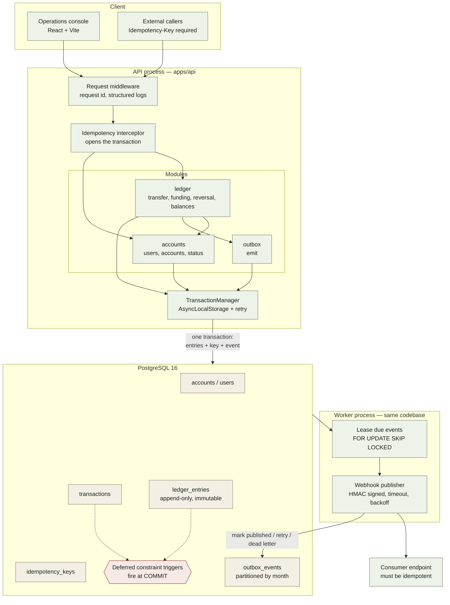

# LedgerCore

[English](./README.en.md) | **한국어**

[](https://github.com/kicheol83/ledger_core/actions/workflows/ci.yml)


PostgreSQL 기반의 복식부기(double-entry) 원장 시스템입니다. 정합성 규칙을 우회할 수 없는 곳, 즉 데이터베이스 자체에서 강제합니다.

이 시스템이 하는 일은 단 하나, 계좌 간 자금 이동을 기록하는 것입니다. 유일한 요구사항은 절대 틀리지 않는 것입니다. 돈이 새로 생기거나 사라지지 않고, 어떤 이체도 두 번 적용되지 않아야 합니다. 요청이 같은 순간에 도착하든, 클라이언트가 재시도하든, 처리 도중 프로세스가 죽든 마찬가지입니다.

이 저장소의 모든 설계는 이 요구사항에서 출발합니다. 실제 비용이 따르는 결정은 무엇을 포기했는지와 함께 [ADR](docs/adr/)에 기록했습니다.

**Live Demo:** https://ledger.javohir.dev

---

## 전체 구조



API와 워커는 코드베이스와 데이터베이스를 공유하지만 별도 프로세스로 실행됩니다. 덕분에 이체와 outbox 이벤트는 하나의 트랜잭션으로 커밋되면서도, 느린 소비자가 이체 지연을 늘리거나 원장이 의존하는 커넥션 풀을 고갈시키는 일은 생기지 않습니다.

락을 획득하는 지점과 지연(deferred) 트리거가 실행되는 지점을 포함한 전체 요청 흐름은 [docs/diagrams/request-lifecycle.mermaid](docs/diagrams/request-lifecycle.mermaid)에 있습니다.

## 파일 구성


---

## 핵심 설계 포인트

**잔액을 저장하지 않습니다.** `balance` 컬럼이 없습니다. 모든 잔액은 불변(immutable) 엔트리 로그를 합산해 계산하므로 진실의 원천이 단 하나이며, 값이 어긋날 가능성이 없습니다. 그 대가로 조회 시 단순 lookup 대신 집계가 필요하지만, covering index로 비용을 제한했고 쿼리 플랜이 index-only scan인지 통합 테스트로 검증합니다.
[ADR-0002](docs/adr/0002-no-balance-column.md)

**불변식은 데이터베이스에 있습니다.** 유효한 트랜잭션을 정의하는 규칙은 네 가지이며, 모두 엔트리 _집합_ 의 속성이라 `CHECK` 제약으로는 표현할 수 없습니다. 그래서 `COMMIT` 시점에 실행되는 deferred constraint trigger로 강제합니다. 마이그레이션이든 스크립트든 향후 다른 서비스든, 균형이 맞지 않는 트랜잭션은 물리적으로 기록할 수 없습니다.
[ADR-0005](docs/adr/0005-database-enforced-invariants.md)

**이체는 `SERIALIZABLE`이 아닌 순서가 정해진 행 락으로 직렬화합니다.** 계좌 행에 대한 락을 id 오름차순으로 획득해 전형적인 A→B / B→A 데드락을 방지합니다. Serializable Snapshot Isolation과의 비교, 그리고 핫 계좌에서 낙관적 동시성 제어가 왜 잘못된 선택인지는 가정이 아닌 문서로 남겼습니다.
[ADR-0006](docs/adr/0006-locking-strategy.md)

**멱등성(idempotency)은 보호 대상 쓰기와 원자적으로 처리됩니다.** 멱등성 키와 원장 엔트리는 하나의 트랜잭션으로 커밋됩니다. 키를 따로 기록하면 안전한 순서가 존재하지 않습니다. 쓰기 전에 기록하면 장애 시 클라이언트의 재시도가 영원히 막히고, 쓰기 후에 기록하면 재시도가 이체를 두 번 실행합니다.

**이벤트는 transactional outbox를 사용합니다.** 이벤트 행은 엔트리와 함께 기록되고, 별도 워커 프로세스가 `FOR UPDATE SKIP LOCKED`로 이를 처리합니다. 큐에 직접 발행하면 dual write가 되어 똑같이 해결할 수 없는 순서 문제가 생깁니다.

**금액은 절대 부동소수점을 거치지 않습니다.** 금액은 `BIGINT` 최소 단위로 저장하고, `bigint` 기반 값 객체로 감싸며, JSON을 포함한 모든 경계에서 문자열로 직렬화합니다. JSON 숫자는 IEEE 754라서 큰 금액이 조용히 손상될 수 있기 때문입니다. 브라우저의 포맷팅 코드조차 문자열로 처리합니다.
[ADR-0001](docs/adr/0001-monetary-values-as-bigint.md)

---

## 로컬 실행

```bash
pnpm install
cp .env.example .env

make up                                          # postgres + redis
pnpm migrate
psql "$DATABASE_URL" -f db/seeds/01-system-accounts.sql

pnpm --filter @ledgercore/api dev                # API      :3000
pnpm --filter @ledgercore/api dev:worker         # worker
pnpm --filter @ledgercore/web dev                # console  :5173
```

Node 20+, pnpm 9+, Docker가 필요합니다.

콘솔은 Accounts 화면에서 시작합니다. 사용자를 추가하고 계좌를 개설해 입금한 뒤 이체해 보세요. Journal에서는 모든 이동의 양쪽 엔트리를, Delivery에서는 이벤트가 전달되는 과정을 볼 수 있습니다.

### 꼭 해볼 만한 데모

**Move money** 화면에서 _copies to send at once_ 를 5로 설정하고 전송하세요. 다섯 개의 요청이 같은 멱등성 키를 가지고 동시에 전송됩니다. 운영 환경에서 게이트웨이 타임아웃이 발생했을 때와 같은 상황입니다.

하나만 적용되고, 나머지 네 개는 첫 번째 요청에 저장된 응답을 그대로 돌려받습니다. 잔액은 한 번만 움직입니다.

---

## 디렉터리 구조

```
apps/api/     NestJS 서비스와 outbox 워커
apps/web/     React 운영 콘솔
db/           마이그레이션, 시드, 스키마를 검증하는 테스트
docs/adr/     아키텍처 결정 기록(ADR)
load-tests/   k6 시나리오
```

`apps/api` 안의 각 모듈은 레이어별로 나뉩니다.

```
domain/          순수 로직: 프레임워크, 데이터베이스, I/O 없음
application/     유스케이스, 트랜잭션 경계 관리
infrastructure/  SQL과 외부 클라이언트
api/             HTTP 컨트롤러와 스키마
```

`domain` 레이어의 격리는 코드 리뷰에 맡기지 않고, `pg`나 `@nestjs`를 import하면 CI를 실패시키는 ESLint 규칙으로 강제합니다.
[ADR-0004](docs/adr/0004-modular-monolith.md)

마이그레이션은 API 패키지가 아닌 `db/`에 있습니다. 스키마는 데이터베이스에 속하는 것이지, 데이터베이스를 읽는 여러 프로세스 중 하나에 속하는 것이 아니기 때문입니다.

---

## 테스트

```bash
pnpm test                                        # 전체
pnpm --filter @ledgercore/api test:unit          # DB 없음, 밀리초 단위
pnpm --filter @ledgercore/api test:integration   # 실제 postgres
pnpm --filter @ledgercore/api test:concurrency   # 실제 병렬 커넥션
```

세 레이어 모두 CI에서 실제 PostgreSQL 16 서비스를 대상으로 실행됩니다. 데이터베이스 mock은 없습니다. 이 시스템이 보장하는 모든 것은 deferred trigger, 행 락, 격리 수준, `SKIP LOCKED` 같은 데이터베이스 동작이며, mock으로는 그 어느 것도 검증할 수 없습니다.

가장 읽어볼 만한 것은 동시성 테스트입니다. 실제 요청을 서로 경쟁시키고, 에러가 없는지가 아니라 결과를 검증합니다.

- 잔액이 세 번의 이체만 감당할 수 있을 때 동시 이체 열 건은 **정확히 세 건**만 성공해야 합니다. 아홉 건 실패도 네 건 성공만큼이나 틀린 결과입니다.
- 같은 두 계좌 간 반대 방향 이체와 8개 계좌 순환 이체. 둘 다 요청 순서대로 락을 잡으면 즉시 데드락이 발생합니다.
- 일부러 잘못된 순서로 락을 잡아 데드락이 발생함을 검증하는 테스트가 있어, 설계가 막아주는 실패 상황을 주장이 아닌 실제로 보여줍니다.
- 한 트랜잭션에 대한 동시 취소(reversal) 두 건은 고객에게 한 번만 환불해야 합니다.
- 모든 테스트는 `verify_ledger_integrity()` 결과가 비어 있고 통화별 합계가 0인 상태로 끝나야 합니다.

---

## 부하 테스트

```bash
make load-baseline      # 경합이 없을 때의 이체 비용
make load-hot           # 모두가 한 계좌에서 출금
make load-idempotency   # 같은 요청의 동시 재시도
make load-mixed         # 읽기와 쓰기 혼합
```

각 시나리오는 하나의 질문에 답하며, 모두 마지막에 대사(reconciliation)를 확인합니다. 원장이 맞지 않는다면 처리량 수치는 의미가 없습니다.

지표는 하나의 에러율로 뭉뚱그리지 않고 결과별로 나눕니다. 잔액 부족으로 인한 422는 시스템이 올바르게 동작한 것이며, 이를 에러로 세면 경합 테스트가 실패처럼 보입니다. 임계값을 넘겨 실패로 처리되는 것은 5xx와 전송 실패뿐입니다.

테스트가 실행되는 동안:

```bash
make locks   # 누가 누구를 막고 있는지 실시간 확인
make slow    # 총 실행 시간 기준 가장 느린 쿼리
```

`load-hot` 실행 중 `make locks`를 보면 출금 계좌 행에 대기열이 생기는 모습이 보입니다. 설계가 의도대로 동작하는 모습을 눈으로 확인할 수 있습니다.

이 테스트는 네트워크 없이 한 대의 머신에서 실행되므로, 절대 수치는 운영 환경의 처리 용량과 무관합니다. 이 테스트가 증명하는 것은 동작의 형태입니다. 서로 겹치지 않는 이체는 경합하지 않고, 핫 계좌는 데드락 대신 대기열을 만들며, 재시도는 중복 제거되고, 이후에도 원장은 균형을 유지합니다. 이는 하드웨어와 관계없이 성립합니다. 자세한 내용은 [load-tests/README.md](load-tests/README.md)를 참고하세요.

---

## 설계 결정

| #                                                     | 결정                         | 자명하지 않았던 이유                                                                         |
| ----------------------------------------------------- | ---------------------------- | -------------------------------------------------------------------------------------------- |
| [0001](docs/adr/0001-monetary-values-as-bigint.md)    | `BIGINT` 최소 단위           | `NUMERIC`도 정확하지만, 드라이버와 애플리케이션 사이의 변환 계층에서 불리함                  |
| [0002](docs/adr/0002-no-balance-column.md)            | 파생 잔액                    | 저장 컬럼은 읽기가 빠르지만, 엔트리와 값이 다를 때 무엇이 맞는지 판단할 수 없음              |
| [0003](docs/adr/0003-raw-sql-over-orm.md)             | ORM 대신 Raw SQL             | Kysely가 가장 강력한 대안이었고, CRUD 범위가 더 넓었다면 Kysely가 나았을 것                  |
| [0004](docs/adr/0004-modular-monolith.md)             | 모듈러 모놀리스              | 원장과 outbox를 분리하면 모든 것이 의존하는 원자성이 깨짐                                    |
| [0005](docs/adr/0005-database-enforced-invariants.md) | 데이터베이스에서 불변식 강제 | 비즈니스 로직이 `plpgsql`에 들어가 테스트가 어렵고, TypeScript만 읽는 사람에게는 보이지 않음 |
| [0006](docs/adr/0006-locking-strategy.md)             | 순서가 정해진 행 락          | `SERIALIZABLE`은 명시적 락이 필요 없지만, 경합 시 완료된 작업을 버려야 함                    |
| [0007](docs/adr/0007-partition-the-outbox.md)         | 원장이 아닌 outbox 파티셔닝  | 원래 계획을 뒤집은 결정. `transactions`를 파티셔닝하면 이중 환불 방지 장치가 조용히 깨짐     |

모든 기록에는 실제 비용과, 결정을 다시 검토해야 할 조건이 적혀 있습니다. ADR-0007은 스키마를 구현하면서 원래 계획이 틀렸다는 것이 드러났기 때문에 존재합니다. 조용히 바꾸기보다 기록으로 남길 가치가 있다고 판단했습니다.

---

## API

모든 금액은 최소 단위의 문자열입니다. 모든 에러는 안정적인 `code`와 서버 로그와 일치하는 trace id를 포함한 [RFC 9457](https://www.rfc-editor.org/rfc/rfc9457) problem document입니다.

```
POST   /v1/users
POST   /v1/accounts
GET    /v1/accounts/:id
PATCH  /v1/accounts/:id/status

GET    /v1/accounts/:id/balance          ?asOfEntryId= 과거 시점 잔액
GET    /v1/balances                      ?userId=
GET    /v1/ledger/reconciliation         ?currency=

POST   /v1/transfers                     Idempotency-Key 필수
POST   /v1/deposits                      Idempotency-Key 필수
POST   /v1/withdrawals                   Idempotency-Key 필수
POST   /v1/transactions/:id/reversal     Idempotency-Key 필수

GET    /v1/transactions/:id              모든 엔트리 포함
GET    /v1/transactions                  ?accountId=  keyset 페이지네이션

GET    /v1/outbox/stats
GET    /v1/outbox/events

GET    /v1/health/live                   데이터베이스에 접근하지 않음
GET    /v1/health/ready                  데이터베이스에 접근함
```

liveness와 readiness는 의도적으로 분리했습니다. 데이터베이스 장애 시 인스턴스는 로드밸런서에서 제외되어야지, 모두 재시작되어 재연결 폭주를 일으켜서는 안 됩니다.

---

## 의도적으로 만들지 않은 것

다중 통화 환전, 이자 계산, 예약 이체는 기능 범위만 넓힐 뿐, 동시성 환경에서의 정합성에 관해 새로 검증하는 것이 없습니다.

인증은 스텁(stub)입니다. 이 프로젝트의 흥미로운 문제는 권한이 아니라 트랜잭션에 있습니다.

차지백 방식의 강제 마이너스 잔액은 지원하지 않습니다. 수취인이 이미 돈을 써버린 거래의 취소는 동의하지 않은 마이너스 잔액을 만드는 대신 거부됩니다. 이런 동작은 한도와 추심이 있는 신용 상품의 영역이며, 절반만 구현하는 것은 아예 구현하지 않는 것보다 나쁩니다.

쓰기의 수평 확장은 다루지 않습니다. 이 규모에서는 단일 Postgres primary가 올바른 답이며, 그렇지 않은 척하는 것은 보여주기에 불과합니다.

---

## 운영 배포

```bash
cp .env.prod.example .env
docker compose -f docker-compose.prod.yml up -d --build
```

하나의 멀티 스테이지 `Dockerfile`이 모든 이미지를 만듭니다: `api`(워커도 같은 이미지 사용), `migrate`, `web`. `migrate`는 시작할 때마다 미적용 마이그레이션과 시스템 계좌 시드를 적용하며, API와 워커는 이 작업이 성공적으로 끝날 때까지 기다립니다.

- 데이터베이스와 Redis 포트는 외부에 노출하지 않습니다. 유일한 진입점은 콘솔을 제공하고 `/v1/*`를 API로 프록시하는 `web` 컨테이너입니다.
- `docker/postgres/postgresql.prod.conf`가 개발용 설정을 대체합니다. 500ms보다 느린 쿼리만 로그에 남기고, 모니터링을 위해 `pg_stat_statements`는 유지합니다.
- 내부 `webhook-sink`가 outbox 이벤트를 수신하므로, 라이브 데모의 Delivery 화면에서 이벤트가 전달되는 과정을 볼 수 있습니다.
- `POSTGRES_PASSWORD`와 `OUTBOX_WEBHOOK_SECRET`은 `openssl rand -hex 32`로 생성합니다.

---

## 참고

`pnpm db:reset`은 볼륨을 삭제하고 마이그레이션부터 다시 구성합니다. 로컬 Postgres는 락 경합이 조용히 묻히지 않고 개발 중에 드러나도록 일부러 로그를 많이 남기게 설정되어 있습니다(`log_statement=all`, `log_lock_waits=on`, 200ms `deadlock_timeout`). 이 설정은 개발 전용이며, `docker/postgres/postgresql.dev.conf`에도 그렇게 명시되어 있습니다.

커밋은 모듈 경계와 일치하는 scope를 가진 Conventional Commits를 따르므로, `git log --grep "ledger"`로 한 모듈의 이력을 재구성할 수 있습니다. 커밋 본문은 _왜_ 를 설명하므로, 이력 자체를 문서로 활용할 수 있습니다.
